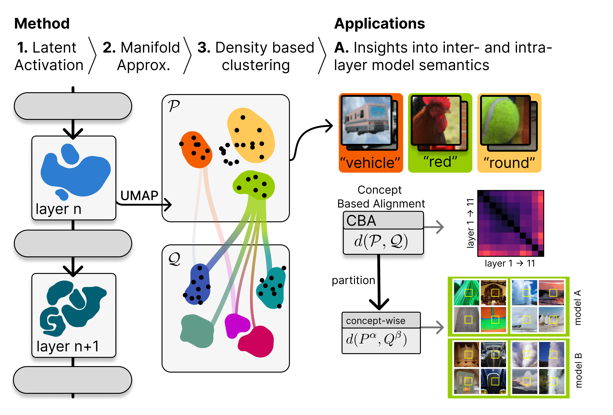

# NLMCD

[](http://arxiv.org/abs/2412.06639)

This repository provides resources to reproduce results from the paper: *Beyond Scalars: Concept-Based Alignment Analysis in Vision Transformers*. This work

 - combines **concept discovery** with **alignment** analysis to provide insights into which concepts are universal or specific between two representations, and how structured a single representation is.
 - proposes a novel concept definition of **concepts as nonlinear manifolds** to faithfully capture the geometry of the feature space with concept proximity scores.
 - leverages a generalized Rand index with pseudo-metric properties to measure the **alignment between concept** proximity scores of two representations and partition it for fine-grained concept alignment.




# Getting started

Installation:
```bash
pip install -r requirements.txt
pip install -e .
```

If cuda is available, install [cuML](https://docs.rapids.ai/install/):

```bash
pip install \
    --extra-index-url=https://pypi.nvidia.com \
    "cudf-cu12==24.10.*" "cuml-cu12==24.10.*"
```

We provide a [tutorial notebook](tutorial/tutorial.ipynb) for how to run and analyze concept discovery and concept-based alignment.


# Reference
For a detailed description of technical details and experimental results, please refer to:

Johanna Vielhaben, Dilyara Bareeva, Jim Berend, Wojciech Samek, Nils Strodthoff: Beyond Scalars: Concept-Based Alignment Analysis in Vision Transformers

 ```   
@misc{
    vielhaben2024beyond,
    title={Beyond Scalars: Concept-Based Alignment Analysis in Vision Transformers}, 
    author={Johanna Vielhaben and Dilyara Bareeva and Jim Berend and Wojciech Samek and Nils Strodthoff},
    year={2024},
    eprint={2412.06639},
    archivePrefix={arXiv},
    primaryClass={cs.CV},
    url={https://arxiv.org/abs/2412.06639}, 
    }
```


